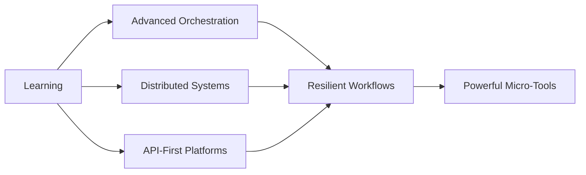

<div align="center">

# 👋 Hey, I'm Advay


[](https://n8n.io)
[](https://workers.cloudflare.com)
[](https://github.com/features/actions)

</div>

---

## 🎯 Philosophy

> **Make everything run itself.**  
> I build high-efficiency automation ecosystems that punch way above their weight—fast, minimal, durable, and cost-free.

<table>
<tr>
<td width="50%">

### 🚀 What I Build

I specialize in creating **production-grade automation systems** that operate at zero cost. My work focuses on:

- **Workflow Engineering**: Advanced n8n implementations with custom nodes and sophisticated logic
- **API Microservices**: High-performance, purpose-built services designed for automation
- **Free-Tier Infrastructure**: Entire production systems deployed without credit cards
- **Cloudflare Ecosystems**: Workers, KV, Durable Objects, and R2 forming robust backends
- **Internal Tooling**: Data processing, routing, scheduling, and event-driven automation

</td>
<td width="50%">


</td>
</tr>
</table>

---

## 🛠️ Technology Arsenal

<details open>
<summary><b>🤖 Automation & Orchestration</b></summary>
<br>

```yaml
n8n: Advanced workflows, custom nodes, complex automation logic
MacroDroid: Mobile automation scripting
JavaScript: Workflow utilities and glue code
```

</details>

<details open>
<summary><b>☁️ Cloud Infrastructure</b></summary>
<br>

| Technology | Use Case |
|------------|----------|
| **Cloudflare Workers** | Serverless APIs, proxies, event processing |
| **Cloudflare KV** | Key-value storage for distributed systems |
| **Cloudflare R2** | Object storage without egress fees |
| **Durable Objects** | Stateful coordination and low-cost persistence |
| **Koyeb** | Zero-cost microservice hosting |
| **Render** | Free-tier application deployments |
| **GitHub Actions** | CI/CD and scheduled automation |

</details>

<details open>
<summary><b>🏗️ Architecture Principles</b></summary>
<br>

- ✅ **Fast** — Low-latency data flows
- ✅ **Minimal** — Clean architecture, no bloat
- ✅ **Durable** — Built to run indefinitely
- ✅ **Zero-maintenance** — Set and forget
- ✅ **Zero-cost** — Maximum efficiency with free tiers

</details>

---

## 📈 Current Focus



I'm currently leveling up in:

- 🎼 **Orchestration Patterns** — Smarter workflow design and coordination
- 🌐 **Distributed Systems** — Building resilient free-tier architectures
- 🔌 **API-First Design** — Creating automation platforms with clean interfaces
- ⚡ **Rapid Prototyping** — Faster ways to ship impactful micro-tools

---

## 🤝 Let's Collaborate

I'm always interested in projects involving:

<div align="center">

| 🔧 Automation | 💡 Clever Engineering | ⚙️ Workflow Optimization | 🛠️ Reliable Tools |
|:-------------:|:---------------------:|:------------------------:|:------------------:|
| End-to-end automation solutions | Creative technical problem-solving | Performance and efficiency gains | Systems people depend on |

</div>

**My style:** I don't do chaos—I build smart systems that run forever once deployed.

---

## 💡 Ask Me About

<table>
<tr>
<td>

- 📐 **System Design** — Blueprinting automation architectures
- 💰 **Cost Optimization** — Scaling on free tiers without compromises
- 🐛 **Debugging** — Workflow troubleshooting and performance tuning

</td>
<td>

- ⚡ **Efficiency Hacks** — Creative solutions to common problems
- 🔄 **Pipeline Building** — Turning unconventional ideas into functional flows
- 🏗️ **Infrastructure** — Cloudflare-based production systems

</td>
</tr>
</table>

---

## 📬 Get In Touch

I keep communication simple and transparent:

<div align="center">

**💬 Open a [GitHub Issue](../../issues) or [Discussion](../../discussions)**  
I respond there first—it keeps conversations public and helpful for others.

</div>

---

## ⚡ Fun Fact

> *"If something takes me longer than 20 seconds daily, I will automate it—aggressively."*

<div align="center">

### 🎨 Powered By

<a href="https://n8n.io" target="_blank">
  
</a>

---

**"Automate the repetitive. Optimize the important. Build what lasts."**


</div>
